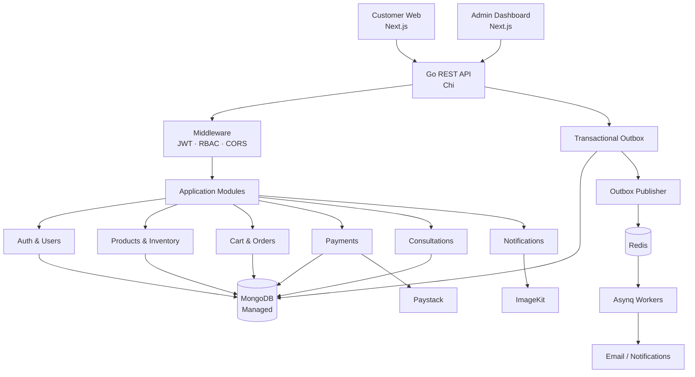

# Denisco Backend

Backend API for **Denisco Global Agriculture Ltd.**, powering its customer-facing website and admin dashboard.

Built with Go as a modular monolith, providing authentication, product management, inventory, order processing, payments, consultation bookings and notifications.

## Tech Stack

* **Language:** Go
* **Router:** Chi
* **Database:** MongoDB
* **Cache & Queues:** Redis, Asynq
* **Authentication:** JWT, bcrypt
* **Payments:** Paystack
* **File Storage:** ImageKit
* **API Documentation:** OpenAPI
* **Logging:** slog
* **Deployment:** Docker, Caddy

## Architecture



## Project Structure

```text
denisco_backend/
├── cmd/
│   ├── api/main.go              # HTTP server entry point
│   ├── worker/main.go           # Background job worker
│   └── outbox-publisher/main.go # Outbox → Redis publisher
├── internal/
│   ├── modules/                 # Business modules
│   │   ├── auth/ users/ products/ inventory/
│   │   ├── cart/ orders/ payments/ consultations/
│   │   └── notifications/ admin/
│   ├── platform/                # Cross-cutting infrastructure
│   │   ├── config/ database/ redis/ queue/
│   │   ├── events/ http/ middleware/ security/
│   │   └── storage/ logger/
│   └── bootstrap/               # Dependency wiring (api.go, worker.go)
├── api/                         # OpenAPI spec
├── scripts/                     # Index creation, seeding
├── tests/                       # Integration, e2e, concurrency
├── deployments/                 # Docker, Caddy, compose
├── .github/workflows/           # CI/CD
├── .env.example
├── go.mod
├── Makefile
└── README.md
```

## Getting Started

**Requirements**

* Go 1.27+
* Docker (for MongoDB / Redis in later phases)
* MongoDB
* Redis

**Setup**

```bash
git clone <repository-url>
cd denisco_backend

cp .env.example .env
```

Fill in the required variables (`APP_PORT`, `MONGODB_URI`, `MONGODB_DATABASE`, `REDIS_URL`, `JWT_*`, `WEB_ORIGIN`, `ADMIN_ORIGIN`).

**Make targets**

```bash
make run-api       # go run ./cmd/api
make run-worker    # go run ./cmd/worker
make run-outbox    # go run ./cmd/outbox-publisher
make build         # build all binaries into bin/
make test          # go test ./...
make vet           # go vet ./...
```

## API

* Base path: `/api/v1`
* Authentication: JWT
* Password hashing: bcrypt
* API documentation: OpenAPI

All successful JSON responses include a `message` and, where applicable, `data`. Errors use a consistent response structure.

## Key Design Principles

* Modular monolith with clear domain boundaries.
* MongoDB as the source of truth.
* Transactional operations for orders, payments and bookings.
* Idempotent payment processing and background jobs.
* Transactional outbox for reliable asynchronous events.
* Backend-enforced authentication, authorization and validation.
* The approved HTML prototype serves as the product and workflow reference.

## Testing

```bash
go test ./...
```
